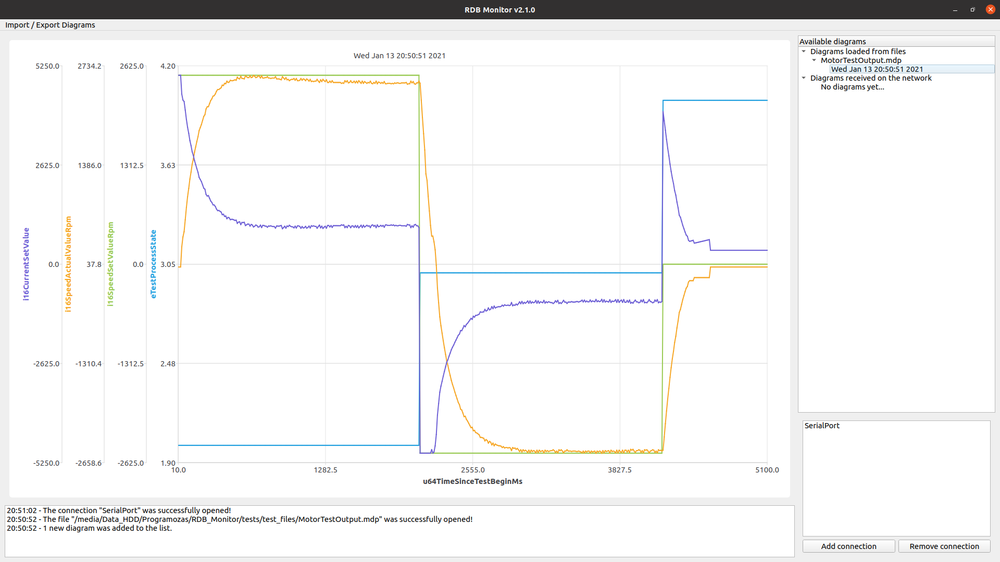

# RDB Monitor <!-- omit in toc -->
[](https://www.gnu.org/licenses/gpl-3.0)

A monitor program originally developed for the [RDB Diplomaterv](https://github.com/KGergo88/RDB_Diplomaterv) project.




## Table of contents <!-- omit in toc -->
- [Introduction](#introduction)
- [Usage](#usage)
- [Supported protocols](#supported-protocols)
  - [Measurement Data Protocol (MDP)](#measurement-data-protocol-mdp)
- [Dependencies](#dependencies)
- [Portability](#portability)
- [Building the project](#building-the-project)
- [Release notes](#release-notes)
  - [v2.1.0 - File handling](#v210---file-handling)
  - [v2.0.0 - Architectural rework](#v200---architectural-rework)
  - [v1.0.2 - Shutdown failure patch](#v102---shutdown-failure-patch)
  - [v1.0.1 - Memory leak patch for the first release](#v101---memory-leak-patch-for-the-first-release)
  - [v1.0.0 - First release](#v100---first-release)
- [License](#license)


## Introduction

The RDB Monitor was originally developed in order to visualise the measurement results of the RDB Diplomaterv project.
Besides this, the program can be used with any other software or device that produces output as described in the [Supported protocols](#supported-protocols) chapter.

At the moment only the serial port can be used for data reception. In the tested environment the ST_LinkV2 debugger of the [RDB Diplomaterv](https://github.com/KGergo88/RDB_Diplomaterv) project
was connected to the PC running the RDB Monitor with a USB cable and the data was received through either a COM port (Windows) or a device in the /dev folder (Linux).


## Usage

The usage of the program is quite straightforward: you need to enter the name of the serial port that you want to listen to into the textfield in the bottom right corner and then click the
"Open Serial Port" button. The port name can be for example "COM3" on Windows or "/dev/ttyACM0" on Linux. The correct name can be found out for example by checking the available ports
before and after connecting the device to the PC and looking for a port that appeared and was not present before.

The following serial port settings are expected by the program:

| Parameter    | Value      |
|:-------------|:----------:|
| Baudrate     | 115200 bps |
| Data bits    | 8          |
| Stop bits    | 1          |
| Parity       | none       |
| Flow control | none       |

The status field in the lower side of the window tells whether the port could be opened or not. After successfully connecting to the port, the text on the button will change to
"Close Serial Port". Then the program will listen to the opened serial port and list every diagram
that was received on the port on the right side of the window. The listed diagrams can be selected for display by clicking on them.

It should be noted that if any other program listens to the same port that you have opened, then the data on the port will not completely received by the monitor,
and this might lead to dropped measurement results because of violations of the measurement data protocol.


## Supported protocols

Protocols are used for the data reception on the network and for data storage in the filesystem.
Currently only one protocol, the Measurement Data Protocol is supported (see chapter [Measurement Data Protocol (MDP)](#measurement-data-protocol-mdp)).

### Measurement Data Protocol (MDP)

- This protocol is used for data reception trough the serial port and for data storage in the file system as well
- It is simple and can be implemented on microcontrollers with limited resources as well
- One data transmission is called a session, that contains data for one diagram
- A session is built up by the following parts:
    - Start pattern
    - Optionally the diagram title
    - The names of the measured quantities and the horizontal axis title
    - The measured values with the horizontal axis values
    - End pattern

The data needs to be formatted the following way in order to be processed by the program:
```
<<<START>>>
<DIAGRAM_TITLE>
"X_AXIS_TITLE","Y0_AXIS_TITLE",...,"Yn_AXIS_TITLE",
"X_AXIS_DATA0","Y0_AXIS_DATA0",...,"Yn_AXIS_DATA0",
.
.
.
"X_AXIS_DATAn","Y0_AXIS_DATAn",...,"Yn_AXIS_DATAn",
<<<END>>>
```

The following requirements have to be fulfilled:
  - The " symbols are not part of the format they are only marking the beginning and the end of an element
  - The measurement data is always starting with the pattern "<<<START>>>"
  - Then the optional diagram title is transmitted, which can be omitted if not needed, in which case a title will be generated for the diagram.
  - Then the headline is transmitted:
    - Every headline element is followed by a comma "," and there are no whitespaces before between and after the elements
    - The headline describes how many different signals were measured and their names
    - There has to be always at least two headline elements transmitted: the common X axis, which is the horizontal axis and at least one Y axis
    - The headline elements:
      - can only contain alphanumeric characters (0..9, A..Z, a..z)
  - Then the headline the measured data is transmitted:
    - Every dataline element is followed by a comma "," and there are no whitespaces before between and after the elements
    - There has to be as many elements in a data line as there was in the headline
    - The data line elements are the values that were measured at the same time
    - All the measured signal values in the data line belong to the first data line element, the common X axis value
    - The data line elements:
      - are integer values
      - can have an optional "+" or "-" sign as a prefix, for example "+25" or "-568"
      - without a sign prefix are considered positive
  - The measurement data is always ending with the pattern "<<<END>>>"
  - This data, starting with the start pattern until the end of the end pattern is called a session that contains all data needed to describe a diagram
  - If there was an error detected in one of the lines then the whole session is invalid

Examples for a session without diagram title and two measured signals:
```
<<<START>>>
u32TimeMs,u32SetValue,u32ActualValue,
0,4000,0,
10,4000,500,
20,4000,1000,
30,4000,1500,
40,4000,2000,
50,4000,2500,
60,4000,3000,
70,4000,3500,
80,4000,4000,
<<<END>>>
```

Examples for a session with diagram title and one measured signal:
```
<<<START>>>
<Living room daily temperature>
u32TimeHour,u8RoomTemperature,
0,15,
2,17,
4,19,
6,18,
8,20,
1022,
12,24,
14,26,
16,24,
18,22,
20,20,
22,18,
<<<END>>>
```


## Dependencies

The RDB Monitor was developed in C++17 and it depends on the following external components:
  - Qt5 v5.12.0 or newer
    - The used components are Core, Widgets, and Charts SerialPort
    - You can download it from the [Qt website](www.qt.io)


## Portability

The RDB Monitor was developed on an Ubuntu 18.04.4 LTS (Bionic Beaver) but it tries to ensure compatibility with Windows 10 as much as possible.
The tagged versions are tested under both Ubuntu and Windows.


## Building the project

The RDB Monitor can be compiled only using the Qt Creator IDE at the moment.


## Release notes

### v2.1.0 - File handling
#### Details:<!-- omit in toc -->
  - Added diagram import/export from/to filesystem
  - Added tree view for the available diagrams
  - MDP protocol: new, optional diagram title feature
  - Reorganizing the diagram storage to use the model-view-controller design pattern
  - Added configuration JSON file handling for default folders and future settings
  - Using layouts to control the window organization
  - Added menu bar

### v2.0.0 - Architectural rework
#### Details:<!-- omit in toc -->
  - Improvement of the GUI especially the diagram view area
  - New status report messages were added so that the user has more info during runtime
  - The program now is a single-threaded application utiling an event based design
  - Implementation of the new design with signal interfaces
  - Further improvement of the data contained classes: DataPoint, DataLine and Diagram
  - Removal of the BOOST from the project
  - The SerialPort class is now implemented with the SerialPort library of the Qt framework

### v1.0.2 - Shutdown failure patch
#### Fixes:<!-- omit in toc -->
  - The shutdown problem that was described in the errata of the v1.0.1 was fixed

### v1.0.1 - Memory leak patch for the first release
#### Fixes:<!-- omit in toc -->
  - The memory that was described in the errata of the v1.0.0 was fixed

#### Errata:<!-- omit in toc -->
  - The worker thread will not join when quitting the program while the serial port is open

### v1.0.0 - First release
#### Functionality:<!-- omit in toc -->
  + Opening a serial port and listening to it
  + Processing and displaying the diagrams received on the serial port
  + Keeping the received diagrams in the list and allowing switching between them

#### Errata:<!-- omit in toc -->
  - A probable memory leak is present in the program
      + It can be seen when there are at least two diagrams listed in the program
      + When it is being switched between them, the memory usage of the program is increasing rapidly with every switch


## License

RDB Monitor
Copyright (C) 2018  András Gergő Kocsis

This program is free software: you can redistribute it and/or modify
it under the terms of the GNU General Public License as published by
the Free Software Foundation, either version 3 of the License, or
(at your option) any later version.

This program is distributed in the hope that it will be useful,
but WITHOUT ANY WARRANTY; without even the implied warranty of
MERCHANTABILITY or FITNESS FOR A PARTICULAR PURPOSE.  See the
GNU General Public License for more details.

You should have received a copy of the GNU General Public License
along with this program (see LICENSE file).  If not, see <https://www.gnu.org/licenses/>.
